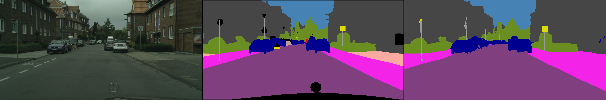

# SOLO
A PyTorch implementation of SOLO based on the paper [SOLO: Segmenting Objects by Locations](https://arxiv.org/abs/1912.04488v2).


## Requirements
- [Anaconda](https://www.anaconda.com/download/)
- [PyTorch](https://pytorch.org)
```
conda install pytorch torchvision cudatoolkit=10.0 -c pytorch
```
- thop
```
pip install thop
```
- opencv
```
pip install opencv-python
```
- cityscapesScripts
```
pip install git+https://github.com/mcordts/cityscapesScripts.git
```

## Expected dataset structure for Cityscapes:
```
cityscapes/
  gtFine/
    train/
      aachen/
        color.png, instanceIds.png, labelIds.png, polygons.json,
        labelTrainIds.png
      ...
    val/
  leftImg8bit/
    train/
    val/
```
Set environment variable `CITYSCAPES_DATASET` firstly, for example:
```
export CITYSCAPES_DATASET=/home/data/cityscapes
```
and then run [createTrainIdLabelImgs.py](https://github.com/mcordts/cityscapesScripts/blob/master/cityscapesscripts/preparation/createTrainIdLabelImgs.py) to creat `labelTrainIds.png`.

## Usage
### Train model
```
python train.py --crop_h 512 --crop_w 1024
optional arguments:
--data_path                   Data path for cityscapes dataset [default value is '/home/data/cityscapes']
--crop_h                      Crop height for training images [default value is 1024]
--crop_w                      Crop width for training images [default value is 2048]
--batch_size                  Number of data for each batch to train [default value is 12]
--save_step                   Number of steps to save predicted results [default value is 5]
--epochs                      Number of sweeps over the dataset to train [default value is 100]
```
Set environment variable `CITYSCAPES_DATASET` and `CITYSCAPES_RESULTS` firstly, for example: 
```
export CITYSCAPES_DATASET=/home/data/cityscapes
export CITYSCAPES_RESULTS=/home/code/Fast-SCNN/results
```
and then run [evalPixelLevelSemanticLabeling.py](https://github.com/mcordts/cityscapesScripts/blob/master/cityscapesscripts/evaluation/evalPixelLevelSemanticLabeling.py) to eval the predicted segmentation.

### Eval model
```
python viewer.py --model_weight 512_1024_model.pth
optional arguments:
--data_path                   Data path for cityscapes dataset [default value is '/home/data/cityscapes']
--model_weight                Pretrained model weight [default value is '1024_2048_model.pth']
--input_pic                   Path to the input picture [default value is 'test/berlin/berlin_000000_000019_leftImg8bit.png']
```

## Results
The experiment is conducted on one NVIDIA Tesla V100 (32G) GPU, and there are some difference between this 
implementation and official implementation:
1. The scales of `Multi-Scale Training` are `(0.5, 0.75, 1.0, 1.25, 1.5, 1.75, 2.0)`;
2. No `color channels noise and brightness` used;
3. No `auxiliary losses` at the end of `learning to downsample` and the `global feature extraction modules` used;
4. The training `epochs` is `100`;
5. `Adam` optimizer with learning rate `1e-3` is used to train this model;
6. No `Polynomial Learning Scheduler` used.

<table>
	<tbody>
		<!-- START TABLE -->
		<!-- TABLE HEADER -->
		<th>Params (M)</th>
		<th>FLOPs (G)</th>
		<th>FPS</th>
		<th>Pixel Accuracy</th>
		<th>Class mIOU</th>
		<th>Category mIOU</th>
		<th>Download</th>
		<!-- TABLE BODY -->
		<tr>
			<td align="center">1.14</td>
			<td align="center">6.92</td>
			<td align="center">197</td>
			<td align="center">81.8</td>
			<td align="center">58.0</td>
			<td align="center">81.7</td>
			<td align="center"><a href="https://pan.baidu.com/s/1cmcAtDewYs2lWK7LaktofQ">model</a>&nbsp;|&nbsp;eg6a</td>
		</tr>
	</tbody>
</table>

The left is input image, the middle is ground truth segmentation, and the right is model's predicted segmentation.


