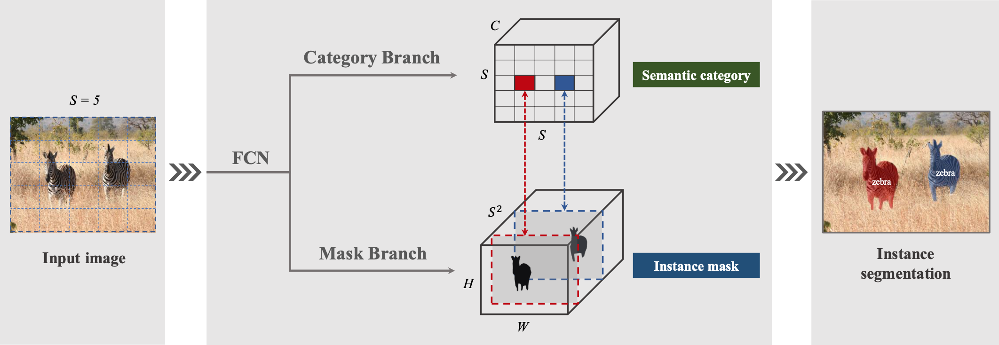

# CGD
A PyTorch implementation of CGD based on the paper [Combination of Multiple Global Descriptors for Image Retrieval](https://arxiv.org/abs/1903.10663v3).



## Requirements
- [Anaconda](https://www.anaconda.com/download/)
- [PyTorch](https://pytorch.org)
```
conda install pytorch torchvision cudatoolkit=10.0 -c pytorch
```
- thop
```
pip install thop
```

## Datasets
[CARS196](http://ai.stanford.edu/~jkrause/cars/car_dataset.html), [CUB200-2011](http://www.vision.caltech.edu/visipedia/CUB-200-2011.html), 
[Standard Online Products](http://cvgl.stanford.edu/projects/lifted_struct/) and 
[In-shop Clothes](http://mmlab.ie.cuhk.edu.hk/projects/DeepFashion/InShopRetrieval.html) are used in this repo.

You should download these datasets by yourself, and extract them into `${data_path}` directory, make sure the dir names are 
`car`, `cub`, `sop` and `isc`. Then run `data_utils.py` to preprocess them.

## Usage
### Train CGD
```
python train.py --feature_dim 512 --gd_config SG
optional arguments:
--data_path                   datasets path [default value is '/home/data']
--data_name                   dataset name [default value is 'car'](choices=['car', 'cub', 'sop', 'isc'])
--crop_type                   crop data or not, it only works for car or cub dataset [default value is 'uncropped'](choices=['uncropped', 'cropped'])
--backbone_type               backbone network type [default value is 'resnet50'](choices=['resnet50', 'resnext50'])
--gd_config                   global descriptors config [default value is 'SM'](choices=['S', 'M', 'G', 'SM', 'MS', 'SG', 'GS', 'MG', 'GM', 'SMG', 'MSG', 'GSM'])
--feature_dim                 feature dim [default value is 1536]
--temperature                 temperature scaling used in softmax cross-entropy loss [default value is 0.5]
--margin                      margin of m for triplet loss [default value is 0.1]
--recalls                     selected recall [default value is '1,2,4,8']
--batch_size                  train batch size [default value is 128]
--num_epochs                  train epoch number [default value is 100]
```

## Benchmarks
The models are trained on one NVIDIA Tesla V100 (32G) GPU with 100 epochs, the learning rate is decayed by 10 on 60th and 80th epoch.

This implement has one small difference with the paper, in the paper, the generation method of Global Descriptors 
is ^\frac{1}{p_c}), but in this repo is 
}).


### Model Parameters and FLOPs (Params/FLOPs)
<table>
  <thead>
    <tr>
      <th>Backbone</th>
      <th>CARS196</th>
      <th>CUB200</th>
      <th>SOP</th>
      <th>In-shop</th>
    </tr>
  </thead>
  <tbody>
    <tr>
      <td align="center">ResNet50</td>
      <td align="center">52M/6.54G</td>
      <td align="center">52M/6.54G</td>
      <td align="center">52M/6.54G</td>
      <td align="center">52M/6.54G</td>
    </tr>
    <tr>
      <td align="center">ResNeXt50</td>
      <td align="center">52M/6.54G</td>
      <td align="center">52M/6.54G</td>
      <td align="center">52M/6.54G</td>
      <td align="center">52M/6.54G</td>
    </tr>
  </tbody>
</table>

### CARS196 (Uncropped/Cropped)
<table>
  <thead>
    <tr>
      <th>Backbone</th>
      <th>R@1</th>
      <th>R@2</th>
      <th>R@4</th>
      <th>R@8</th>
      <th>Download Link</th>
    </tr>
  </thead>
  <tbody>
    <tr>
      <td align="center">ResNet50(SG)</td>
      <td align="center">93.3%</td>
      <td align="center">96.2%</td>
      <td align="center">97.7%</td>
      <td align="center">98.5%</td>
      <td align="center"><a href="https://pan.baidu.com/s/1m91YFmycmD4xwGCDJVJFHQ">model</a>&nbsp;|&nbsp;s4gj</td>
    </tr>
    <tr>
      <td align="center">ResNeXt50(SG)</td>
      <td align="center">93.9%</td>
      <td align="center">96.5%</td>
      <td align="center">97.8%</td>
      <td align="center">98.7%</td>
      <td align="center"><a href="https://pan.baidu.com/s/1NVAcxCxIuXBlxW13hf82TQ">model</a>&nbsp;|&nbsp;dcrm</td>
    </tr>
  </tbody>
</table>

### CUB200 (Uncropped/Cropped)
<table>
  <thead>
    <tr>
      <th>Backbone</th>
      <th>R@1</th>
      <th>R@2</th>
      <th>R@4</th>
      <th>R@8</th>
      <th>Download Link</th>
    </tr>
  </thead>
  <tbody>
    <tr>
      <td align="center">ResNet50(MG)</td>
      <td align="center">77.8%</td>
      <td align="center">84.9%</td>
      <td align="center">89.9%</td>
      <td align="center">93.7%</td>
      <td align="center"><a href="https://pan.baidu.com/s/1x5ckVuS9pm7hMrynsmaS6w">model</a>&nbsp;|&nbsp;pa8c</td>
    </tr>
    <tr>
      <td align="center">ResNeXt50(MG)</td>
      <td align="center">80.1%</td>
      <td align="center">86.8%</td>
      <td align="center">91.5%</td>
      <td align="center">94.8%</td>
      <td align="center"><a href="https://pan.baidu.com/s/19qkoDtZwCdQpN-bJ2FiP9g">model</a>&nbsp;|&nbsp;u37j</td>
    </tr>
  </tbody>
</table>

### SOP
<table>
  <thead>
    <tr>
      <th>Backbone</th>
      <th>R@1</th>
      <th>R@10</th>
      <th>R@100</th>
      <th>R@1000</th>
      <th>Download Link</th>
    </tr>
  </thead>
  <tbody>
    <tr>
      <td align="center">ResNet50(SG)</td>
      <td align="center">85.3%</td>
      <td align="center">90.7%</td>
      <td align="center">93.9%</td>
      <td align="center">96.8%</td>
      <td align="center"><a href="https://pan.baidu.com/s/1_xaiZKwHp3BAp0U1K1ImrQ">model</a>&nbsp;|&nbsp;vsps</td>
    </tr>
    <tr>
      <td align="center">ResNeXt50(SG)</td>
      <td align="center">87.8%</td>
      <td align="center">93.2%</td>
      <td align="center">96.0%</td>
      <td align="center">98.1%</td>
      <td align="center"><a href="https://pan.baidu.com/s/1HCzf6ROjePEyKWs-h3kDsA">model</a>&nbsp;|&nbsp;8588</td>
    </tr>
  </tbody>
</table>

### In-shop
<table>
  <thead>
    <tr>
      <th>Backbone</th>
      <th>R@1</th>
      <th>R@10</th>
      <th>R@20</th>
      <th>R@30</th>
      <th>R@40</th>
      <th>R@50</th>
      <th>Download Link</th>
    </tr>
  </thead>
  <tbody>
    <tr>
      <td align="center">ResNet50(GS)</td>
      <td align="center">78.7%</td>
      <td align="center">93.2%</td>
      <td align="center">95.2%</td>
      <td align="center">96.1%</td>
      <td align="center">96.7%</td>
      <td align="center">97.0%</td>
      <td align="center"><a href="https://pan.baidu.com/s/1yqwTTiGKWnZfkoSZs1LuvQ">model</a>&nbsp;|&nbsp;6dh2</td>
    </tr>
    <tr>
      <td align="center">ResNeXt50(GS)</td>
      <td align="center">87.7%</td>
      <td align="center">96.7%</td>
      <td align="center">97.7%</td>
      <td align="center">98.1%</td>
      <td align="center">98.4%</td>
      <td align="center">98.6%</td>
      <td align="center"><a href="https://pan.baidu.com/s/1Kf0Tq_q2ODTAp3RXV2_idQ">model</a>&nbsp;|&nbsp;xam8</td>
    </tr>
  </tbody>
</table>