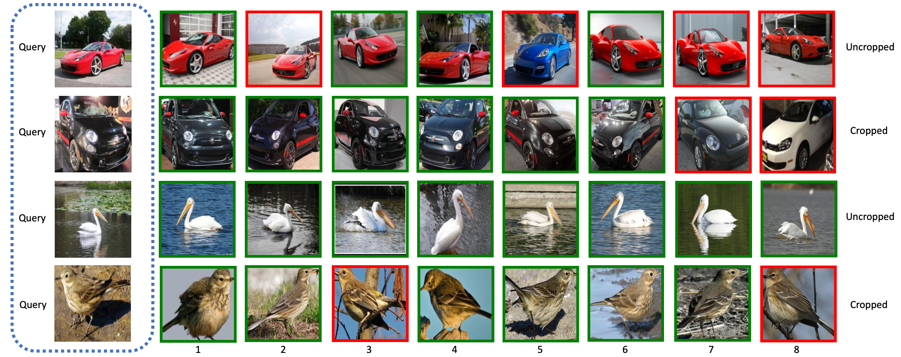

# CGD
A PyTorch implementation of CGD based on the paper [Combination of Multiple Global Descriptors for Image Retrieval](https://arxiv.org/abs/1903.10663v3).


## Requirements
- [Anaconda](https://www.anaconda.com/download/)
- [PyTorch](https://pytorch.org)
```
conda install pytorch torchvision cudatoolkit=10.0 -c pytorch
```
- thop
```
pip install thop
```

## Datasets
[CARS196](http://ai.stanford.edu/~jkrause/cars/car_dataset.html), [CUB200-2011](http://www.vision.caltech.edu/visipedia/CUB-200-2011.html), 
[Standard Online Products](http://cvgl.stanford.edu/projects/lifted_struct/) and 
[In-shop Clothes](http://mmlab.ie.cuhk.edu.hk/projects/DeepFashion/InShopRetrieval.html) are used in this repo.

You should download these datasets by yourself, and extract them into `${data_path}` directory, make sure the dir names are 
`car`, `cub`, `sop` and `isc`. Then run `data_utils.py` to preprocess them.

## Usage
### Train CGD
```
python train.py --feature_dim 512 --gd_config SM
optional arguments:
--data_path                   datasets path [default value is '/home/data']
--data_name                   dataset name [default value is 'car'](choices=['car', 'cub', 'sop', 'isc'])
--crop_type                   crop data or not, it only works for car or cub dataset [default value is 'uncropped'](choices=['uncropped', 'cropped'])
--backbone_type               backbone network type [default value is 'resnet50'](choices=['resnet50', 'resnext50'])
--gd_config                   global descriptors config [default value is 'SG'](choices=['S', 'M', 'G', 'SM', 'MS', 'SG', 'GS', 'MG', 'GM', 'SMG', 'MSG', 'GSM'])
--feature_dim                 feature dim [default value is 1536]
--smoothing                   smoothing value for label smoothing [default value is 0.1]
--temperature                 temperature scaling used in softmax cross-entropy loss [default value is 0.5]
--margin                      margin of m for triplet loss [default value is 0.1]
--recalls                     selected recall [default value is '1,2,4,8']
--batch_size                  train batch size [default value is 128]
--num_epochs                  train epoch number [default value is 20]
```

### Test CGD
```
python test.py --retrieval_num 10
optional arguments:
--query_img_name              query image name [default value is '/home/data/car/uncropped/008055.jpg']
--data_base                   queried database [default value is 'car_uncropped_resnet50_SG_1536_0.1_0.5_0.1_128_data_base.pth']
--retrieval_num               retrieval number [default value is 8]
```

## Benchmarks
The models are trained on one NVIDIA Tesla V100 (32G) GPU with 20 epochs, 
the learning rate is decayed by 10 on 12th and 16th epoch.

### Model Parameters and FLOPs (Params | FLOPs)
<table>
  <thead>
    <tr>
      <th>Backbone</th>
      <th>CARS196</th>
      <th>CUB200</th>
      <th>SOP</th>
      <th>In-shop</th>
    </tr>
  </thead>
  <tbody>
    <tr>
      <td align="center">ResNet50</td>
      <td align="center">26.86M | 10.64G</td>
      <td align="center">26.86M | 10.64G</td>
      <td align="center">49.85M | 10.69G</td>
      <td align="center">34.85M | 10.66G</td>
    </tr>
    <tr>
      <td align="center">ResNeXt50</td>
      <td align="center">26.33M | 10.84G</td>
      <td align="center">26.33M | 10.84G</td>
      <td align="center">49.32M | 10.89G</td>
      <td align="center">34.32M | 10.86G</td>
    </tr>
  </tbody>
</table>

### CARS196 (Uncropped | Cropped)
<table>
  <thead>
    <tr>
      <th>Backbone</th>
      <th>R@1</th>
      <th>R@2</th>
      <th>R@4</th>
      <th>R@8</th>
      <th>Download Link</th>
    </tr>
  </thead>
  <tbody>
    <tr>
      <td align="center">ResNet50(SG)</td>
      <td align="center">86.4% | 92.4%</td>
      <td align="center">92.1% | 96.1%</td>
      <td align="center">95.6% | 97.8%</td>
      <td align="center">97.5% | 98.7%</td>
      <td align="center"><a href="https://pan.baidu.com/s/1W3-QKVe5HpCAHJTgxI1M5Q">r3sn</a> | <a href="https://pan.baidu.com/s/171Wqa-1TNquzedjlFhaYGg">sf5s</a></td>
    </tr>
    <tr>
      <td align="center">ResNeXt50(SG)</td>
      <td align="center">86.4% | 91.7%</td>
      <td align="center">92.0% | 95.4%</td>
      <td align="center">95.4% | 97.3%</td>
      <td align="center">97.6% | 98.6%</td>
      <td align="center"><a href="https://pan.baidu.com/s/1pdp6ePxaxcvGbdlOz1Kmtg">dsdx</a> | <a href="https://pan.baidu.com/s/1_dpDM4FNkzPYPvmOsTTR1w">fh72</a></td>
    </tr>
  </tbody>
</table>

### CUB200 (Uncropped | Cropped)
<table>
  <thead>
    <tr>
      <th>Backbone</th>
      <th>R@1</th>
      <th>R@2</th>
      <th>R@4</th>
      <th>R@8</th>
      <th>Download Link</th>
    </tr>
  </thead>
  <tbody>
    <tr>
      <td align="center">ResNet50(MG)</td>
      <td align="center">66.0% | 73.9%</td>
      <td align="center">76.4% | 83.1%</td>
      <td align="center">84.8% | 89.6%</td>
      <td align="center">90.7% | 94.0%</td>
      <td align="center"><a href="https://pan.baidu.com/s/1_Ij-bYHZC31cxEWUnYwqwQ">2cfi</a> | <a href="https://pan.baidu.com/s/1deaYb2RWHikztHHsbJyuNw">pi4q</a></td>
    </tr>
    <tr>
      <td align="center">ResNeXt50(MG)</td>
      <td align="center">66.1% | 73.7%</td>
      <td align="center">76.3% | 82.6%</td>
      <td align="center">84.0% | 89.0%</td>
      <td align="center">90.1% | 93.3%</td>
      <td align="center"><a href="https://pan.baidu.com/s/1BvhZIBXj9M-Ro9BLmI2lmg">nm9h</a> | <a href="https://pan.baidu.com/s/1lu7SYe3tLhp2v1kkI5fO9w">6mkf</a></td>
    </tr>
  </tbody>
</table>

### SOP
<table>
  <thead>
    <tr>
      <th>Backbone</th>
      <th>R@1</th>
      <th>R@10</th>
      <th>R@100</th>
      <th>R@1000</th>
      <th>Download Link</th>
    </tr>
  </thead>
  <tbody>
    <tr>
      <td align="center">ResNet50(SG)</td>
      <td align="center">79.3%</td>
      <td align="center">90.6%</td>
      <td align="center">95.8%</td>
      <td align="center">98.6%</td>
      <td align="center"><a href="https://pan.baidu.com/s/17I2nQMK5XBXL1XhiZ2elAg">qgsn</a></td>
    </tr>
    <tr>
      <td align="center">ResNeXt50(SG)</td>
      <td align="center">71.0%</td>
      <td align="center">85.3%</td>
      <td align="center">93.5%</td>
      <td align="center">97.9%</td>
      <td align="center"><a href="https://pan.baidu.com/s/1rAGMchtLNTdQQxDWD6ruOg">uexd</a></td>
    </tr>
  </tbody>
</table>

### In-shop
<table>
  <thead>
    <tr>
      <th>Backbone</th>
      <th>R@1</th>
      <th>R@10</th>
      <th>R@20</th>
      <th>R@30</th>
      <th>R@40</th>
      <th>R@50</th>
      <th>Download Link</th>
    </tr>
  </thead>
  <tbody>
    <tr>
      <td align="center">ResNet50(GS)</td>
      <td align="center">83.6%</td>
      <td align="center">95.7%</td>
      <td align="center">97.1%</td>
      <td align="center">97.7%</td>
      <td align="center">98.1%</td>
      <td align="center">98.4%</td>
      <td align="center"><a href="https://pan.baidu.com/s/10Ow0JhXzRcPVsv5-j14ZjQ">8jmp</a></td>
    </tr>
    <tr>
      <td align="center">ResNeXt50(GS)</td>
      <td align="center">85.0%</td>
      <td align="center">96.1%</td>
      <td align="center">97.3%</td>
      <td align="center">97.9%</td>
      <td align="center">98.2%</td>
      <td align="center">98.4%</td>
      <td align="center"><a href="https://pan.baidu.com/s/1eCt_IjLYSccnCrBk5XRjTQ">wdq5</a></td>
    </tr>
  </tbody>
</table>

## Results

### CAR/CUB (Uncropped | Cropped)



### SOP/ISC

