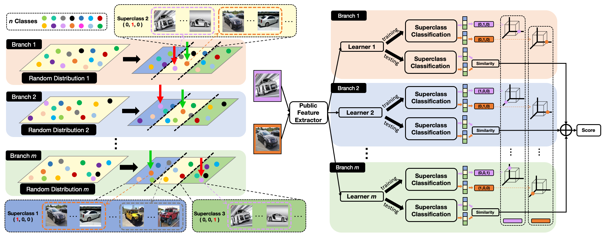

# AntiMetric
A PyTorch implementation of AntiMetric based on ICCV 2021 paper [AntiMetric: Anti-metric method for computer vision]().

<div align="center">
  
</div>

## Requirements
- [Anaconda](https://www.anaconda.com/download/)
- [PyTorch](https://pytorch.org)
```
conda install pytorch torchvision cudatoolkit=10.0 -c pytorch
```

## Dataset
[ImageNet](http://image-net.org) dataset is used in this repo.

## Usage
### Train Model
```
python train.py --num_epochs 50 --load_ids
optional arguments:
--data_path                   path to dataset [default value is '/home/data/imagenet/ILSVRC2012']
--with_random                 with branch random weight or not [default value is False]
--load_ids                    load already generated ids or not [default value is False]
--batch_size                  train batch size [default value is 256]
--num_epochs                  train epochs number [default value is 100]
--ensemble_size               ensemble model size [default value is 12]
--meta_class_size             meta class size [default value is 32]
--gpu_ids                     selected gpu [default value is '0,1,2,3,4,5,6,7']
```
